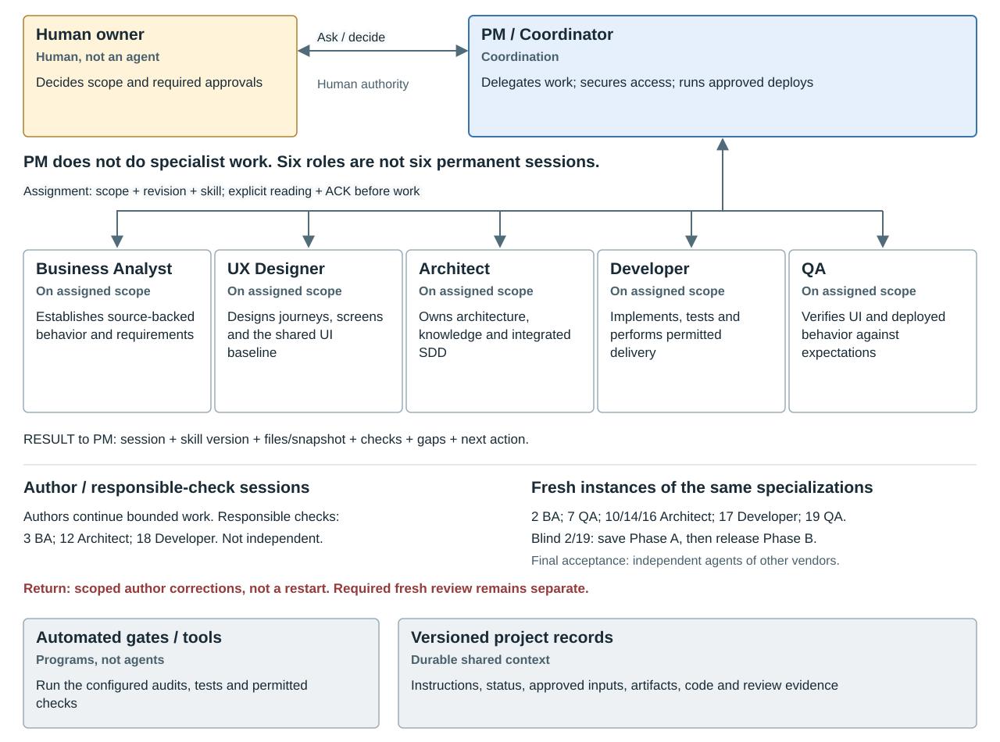

# Agent System Overview

**Who coordinates the work, who does it, who checks it, and how do they exchange results?**

Purpose and maintenance

The authorized process maintainer creates and maintains this explanation under
the [role contract](agent-roles.md) and [process maintenance rules](process-contract.md#authority-and-maintenance).
It records no project decision; the human owner retains all approval authority.
The generated views are summaries, not stage instructions or execution evidence.

<!-- ARTIFACT_READING_START -->
> [!NOTE]
> **Six portable roles, not a fixed-size team or a running service.**
> PM must delegate specialist work to BA, UX, Architect, Developer or QA.
> Fresh eligible instances of those same specializations perform independent checks.
> Human decisions and automated gates remain separate. [See the sequence](#example-sequence).

<strong>Contents</strong>

- [One-Picture Overview](#read-one-picture-overview)
- [Small Feature Example](#read-small-feature-example)
- [Example Sequence](#read-example-sequence)
- [Roles](#read-roles)
- [People, Tools And Records](#read-people-tools-and-records)
- [How Many Agents](#read-how-many-agents)
- [Invocation And Communication](#read-invocation-and-communication)
- [Where Stages Fit](#read-where-stages-fit)
- [Reading And Maintenance](#read-reading-and-maintenance)

<!-- ARTIFACT_READING_END -->

## One-Picture Overview

[Open the diagram page](agent-system/index.html).

## Small Feature Example

**XPlanner from Bootstrap to one delivered feature: who acts next, and when is a new agent started?**

This illustrative happy path combines project preparation at Bootstrap and
Stages 1-14 with one feature at Stages 15-19: renaming a project. It is not a
reconstructed history of XPlanner's actual agent sessions or approvals. No
existing status, unresolved review or project evidence is superseded by it.

The running example is grounded in XPlanner's
[Project Workspace specification](https://github.com/olsys-ltd/xplanner2/blob/de7f84ed6a539f314cbb0ae75509ae1146c886e6/specs/004-project-workspace/spec.md):
User Story 4 and FR-304/306/308 cover editing an existing project's Name,
validation, atomic update and stale-write protection. The drawing highlights
that behavior, not the whole scope of slice 004 or an invented separate SDD.

In the first part, BA investigates the project and records editing in the parity
map; the owner decides the target scope. UX uses the approved UI foundation to
draw the project editor with its name field, Save action and states. Architect
covers requirements, dependencies, permitted writes and persistence; approved
knowledge is prepared for downstream design. These are project/baseline activities
with this feature as an example, not a separate project-wide discovery for every
feature. Approval covers the declared architecture layer and supported slices,
not all future architecture decisions. Changed features repeat the applicable
UI/architecture controls; unchanged baselines are reused.

The owner launches **PM** during Bootstrap. PM prepares the workspace;
the owner ratifies its rules and separately authorizes discovery. PM remains
the accountable coordinator, but does not perform specialist migration work.
It delegates sequentially to four continuing author sessions: **BA author**,
**UX author**, **Architect author** and **Developer author**. QA participates in
the required independent reviews; this example needs no separate QA author session.
On-demand support remains possible, not a requirement to start every specialist
in author mode or run them all concurrently.

PM also invokes seven fresh reviewer sessions: **BA review 2**, **QA review 7**,
**Architect review 10**, **Architect review 14**, **Architect review 16**,
**Developer peer 17** and **QA review 19**. Review is a mode of the same
specializations, not a seventh portable role. Each starts through an approved
transport, explicitly reads its skill and returns ACK before work, then RESULT
with its immutable report. It finishes without being reused as the next reviewer.
Stages **3, 12 and 18** are responsible checks by **BA author**, **Architect author**
and **Developer author**, respectively, not fresh independent passes.
Stage 12 still records the unchanged approved set and zero required fixes when
the owner has no remarks; it never edits the architecture or the owner verdict.

This diagram has **12 illustrative agent sessions: 1 PM + 4 specialist authors +
7 fresh reviewers**. The generator derives starts and counts from the sequence
below and verifies assignments against the normative role contract. It assumes
no restarts, findings, repeated controls or additional support tasks. This is not
a universal minimum or a permanent team size. Session replacement resumes from
durable files, not hidden shared memory.

The example's stage column and mobile sequence show the full process stage names,
matching the process diagram. Numeric stage IDs remain in the source table and
generated metadata for routing and checks; readers need not memorize the numbers.

The owner dispositions the full implementation-assumptions table before the
Stage 16 review, then separately authorizes implementation after clean review.
Stage 17 gates and remote CI must pass before the owner merges. Merge and
permission for the delivery operation are actual human decisions, not a clean
review label. Authoring specialists record their own artifacts and assigned
owner decisions; at Stage 19 PM records the owner's walkthrough/decline and
sign-off, while QA returns independent evidence only. PM verifies handoffs and
alone integrates permitted status/shared-record updates.

QA review 19 independently tests the deployed feature: save Phase A observations first,
then open prior reports and reconcile in Phase B. The illustration chooses an
eligible other-vendor QA session; the final consolidated acceptance rule
still requires other-vendor agents. This slice example is not final approval of
the entire migration. The owner accepts the slice and decides continuation.
Final completion separately requires final owner sign-off and an owner
walkthrough or its exact recorded decline; this slice example does not exercise
that final decision.
BA review 2 likewise saves its own source-derived inventory in Phase A before
seeing the filled map, reconnaissance and prior conclusions in Phase B.
Stage 3 assumes BA can perform the authorized live walkthrough; its conditional
owner fallback is not exercised on this happy path.

The record column below names the principal handoff only, not the full artifact
or command inventory. Tools are not extra agents. A finding exits this happy
path and follows the existing return/correction procedure.

## Example Sequence

PM coordinates every row, requests human decisions and checks ACK/RESULT;
the Role column identifies who executes the illustrated work or decision.
`author` means artifact production; `responsible-check` means the responsible
specialist verifies its scope, not an independent pass. `independent-review`
and `peer-review` require fresh eligible sessions; `coordinate` is PM routing
and explicitly authorized deployment tool execution at Stages 3 and 18.
PM obtains owner-approved access and scope before deploying. BA/Developer keep
their own verification/report duties; the [deployment handoff](../config/REMOTE_SERVER.md#configure-before-remote-work)
records the actual executor and evidence, without inventing an owner decision.
`decision` is human authority, not an agent mode. A `clean` report means the
required scoped review found no remaining findings, not owner approval.

| ID | Stage | Role | Mode | Session | Action | Handoff |
|---|---|---|---|---|---|---|
| bootstrap | 0 | pm | coordinate | PM | Prepares the workspace | Instructions, status, environment |
| bootstrap-decision | 0 | owner | decision | human | Ratifies rules; starts discovery | Separate recorded decisions |
| reconnaissance | 1 | ba | author | BA author | Investigates legacy XPlanner | Map includes project editing |
| reconnaissance-review | 2 | ba | independent-review | BA review 2 | Inspects legacy independently | Own inventory, then reconciliation |
| legacy-deployment | 3 | pm | coordinate | PM | Deploys approved legacy | Owner access + isolated baseline |
| live-walkthrough | 3 | ba | responsible-check | BA author | Checks the running legacy | Tries editing a project name |
| requirements-preparation | 4 | ba | author | BA author | Prepares requirement choices | Source-backed scope proposals |
| requirements | 4 | owner | decision | human | Decides target requirements | Keep project renaming in scope |
| foundation-preparation | 5 | ux | author | UX author | Proposes the UI foundation | Form, palette, accessibility |
| ui-foundation | 5 | owner | decision | human | Chooses the UI foundation | Pins the selected foundation |
| wireframes | 6 | ux | author | UX author | Draws screens and components | Example: Name field and Save |
| wireframe-review | 7 | qa | independent-review | QA review 7 | Checks the wireframes | Form, states and navigation |
| ui-approval-preparation | 8 | ux | author | UX author | Presents the exact UI set | Screens, components and tokens |
| ui-approval | 8 | owner | decision | human | Approves the UI baseline | Exact combined approval |
| architecture | 9 | architect | author | Architect author | Designs target architecture | Permissions, writes, dependencies |
| nfr-decision | 9 | owner | decision | human | Decides NFRs and slice scope | Required now versus deferred |
| architecture-review | 10 | architect | independent-review | Architect review 10 | Checks the architecture | Requirements and dependencies |
| architecture-approval-preparation | 11 | architect | author | Architect author | Presents the architecture set | Exact reviewed hashes |
| architecture-approval | 11 | owner | decision | human | Approves architecture scope | Pins the exact approved set |
| closure | 12 | architect | responsible-check | Architect author | Verifies remark closure | Report; no architecture edits |
| knowledge | 13 | architect | author | Architect author | Synthesizes target knowledge | Approved decisions to OKF |
| knowledge-review | 14 | architect | independent-review | Architect review 14 | Checks the knowledge package | Source fidelity and completeness |
| design | 15 | architect | author | Architect author | Designs project renaming | Integrated SDD + checks + gates |
| assumptions | 15 | owner | decision | human | Confirms all assumptions | Recorded owner dispositions |
| design-review | 16 | architect | independent-review | Architect review 16 | Checks the SDD independently | Clean review report |
| implement-decision | 16 | owner | decision | human | Authorizes implementation | Separate owner decision |
| implement | 17 | developer | author | Developer author | Writes code and runs checks | Code + tests + gates + remote CI |
| code-review | 17 | developer | peer-review | Developer peer 17 | Checks code independently | Clean peer review report |
| merge | 17 | owner | decision | human | Approves merge and delivery | Recorded owner decisions |
| release-deployment | 18 | pm | coordinate | PM | Deploys approved release | Rechecks grant; exact revision |
| deliver | 18 | developer | responsible-check | Developer author | Verifies and reconciles live | New name survives page reload |
| acceptance | 19 | qa | independent-review | QA review 19 | Tests project renaming | Observes first; reconciles after |
| accept | 19 | owner | decision | human | Accepts this feature slice | Acceptance + continuation decision |

[Open the English example](agent-system/index.html).
The example, its downloads, agent instructions and project evidence are English.
The previous `en.html` and `example.ru.svg` URLs remain English compatibility
aliases so existing links still work; there is no separate Russian example.

## Roles

| ID | Title | Count | Responsibility | Output |
|---|---|---|---|---|
| pm | PM / Coordinator | Coordination | Delegates work; secures access; runs approved deploys | Assignments and shared records |
| ba | Business Analyst | On assigned scope | Establishes source-backed behavior and requirements | Reconnaissance and scope |
| ux | UX Designer | On assigned scope | Designs journeys, screens and the shared UI baseline | UI foundation and wireframes |
| architect | Architect | On assigned scope | Owns architecture, knowledge and integrated SDD | Architecture, OKF and SDD |
| developer | Developer | On assigned scope | Implements, tests and performs permitted delivery | Code, tests and live evidence |
| qa | QA | On assigned scope | Verifies UI and deployed behavior against expectations | Comparisons and gaps |

These six specializations and their exact skills come from the normative
[role contract](agent-roles.md#roles). Independent review is a mode, not another
role. The same specialization/skill is reused in a different eligible session,
never by reusing author context. The generator reads that contract directly.

## People, Tools And Records

| ID | Title | Count | Responsibility | Output |
|---|---|---|---|---|
| owner | Human owner | Human, not an agent | Decides scope and required approvals | Explicit decisions |
| tools | Automated gates / tools | Programs, not agents | Run the configured audits, tests and permitted checks | Logs and measured results |
| records | Versioned project records | Durable shared context | Instructions, status, approved inputs, artifacts, code and review evidence | Exact paths, revisions and hashes |

## How Many Agents

- **Delegation is mandatory:** PM coordinates; separately assigned specialists
  execute migration work. PM does not switch persona to do their work itself.
- **Sessions follow the scope:** author sessions may continue bounded work;
  every independent pass starts fresh. Support and parallelism are optional,
  with satisfied dependencies and one writer per file. No permanent team is required.
- **No fixed total:** twenty checkpoints do not mean twenty permanent agents.
  Stages name responsibilities, not processes that are all running together.
  Corrections can require additional fresh reviewer sessions.
- **PM is accountable, not all-powerful:** it cannot approve its
  own work, replace the reviewer's conclusion or invent the owner's consent.
  If its session is replaced, routing resumes from durable records, not memory alone.

## Invocation And Communication

**Read each exchange as three messages, not two:**

| Direction | Message | Plain meaning |
|---|---|---|
| PM to specialist | Task + instructions | Here is the bounded work, exact inputs, stage procedure and role skill. |
| Specialist to PM, before work | ACK (acknowledgement) | I read the instructions and understand the task and its boundaries. This is not completion or approval. |
| Specialist to PM, after work | RESULT | Here are the exact files, checks and remaining gaps; for review, the report and its evidence. |

A review packet is a task package for a fresh eligible reviewer, not another
kind of agent. It includes only the inputs permitted in the current review
phase. Evidence means the records supporting a claim, not just "done" in chat.
Blue exchanges belong to authors/responsible checks; green exchanges to fresh
independent/peer reviews. NEW marks a session start; repeated assignments do not
necessarily create new agents.

**Instruction chain:** [MIGRATION.md](../MIGRATION.md) determines session routing
and permitted work. The active stage in the
[methodology](migration_methodology.md#actors) defines inputs, work, outputs and
checks. The [role contract](agent-roles.md) assigns the specialist and handoff
rules; its skill helps execute that procedure, not replace it.

1. The owner starts or authorizes the work. PM reads
   [MIGRATION.md](../MIGRATION.md), the constitution, current status and applicable
   instructions. It identifies the permitted scope and next action.
2. PM delegates the exact role/mode using a unique assignment ID, stage/scope,
   source revision or identified snapshot, allowed/withheld inputs, explicit
   write allowlist, exact skill path, checks and return destination. The receiver
   opens that `SKILL.md`, the role contract and assigned procedure even without
   native skill discovery, then returns **ACK** with session identity, role/mode,
   scope, input revision and skill commit/hash. PM verifies ACK before work is accepted.
3. The specialist writes only its assigned artifacts and self-checks/gates them.
   **RESULT** identifies the task/session, role/mode, loaded skills, exact result
   snapshot, files, checks/outcomes, applicable CHK checks, gaps and next action.
   PM verifies versions, output existence, evidence and write boundaries before
   integrating permitted shared records. A chat-only completion claim is insufficient.
4. At an independent checkpoint, the coordinator prepares the deterministic
   packet and invokes a fresh eligible reviewer. Formal review uses an immutable
   revision and isolated read-only worktree; the reviewer writes its report
   outside the reviewed worktree. It does not fix the author's files.
5. The reviewer returns RESULT with its conclusion and exact report/evidence references.
   The coordinator validates findings and routes accepted corrections to the
   responsible authoring stage. The author records dispositions and reruns
   affected checks. Material corrections receive a fresh review; unresolved
   material disputes escalate to the owner, not an endless agent discussion.
6. At a required human gate the coordinator stops and asks. A clean review
   and green scripts do not supply that decision. The authoring lead records
   assigned owner decisions. At Stage 19 PM records the owner walkthrough/decline
   and sign-off; QA returns independent evidence only. PM alone records permitted
   transitions in existing status.

**Transport is portable:** the same assignment, explicit skill reading, ACK and
RESULT use an available delegation tool, approved CLI or owner-launched separate
session. Native client profiles and automatic skill discovery are conveniences,
not the contract. A provider/client change first needs a bounded read-only ACK
probe and verified isolation/tool access. An unavailable capability blocks that
task; it does not permit PM to impersonate the specialist or claim success.
No specialist launches additional workers by default; PM controls delegation.

**QUESTION / BLOCKED:** specialists name the task, exact source references,
uncertainty and needed decision. PM routes the issue, records the authorized
answer and sends it to every affected participant. Conflicting decisions or
overlapping writes pause affected work. Bounded specialist discussion cannot
expand scope, change an approved baseline or replace a human decision.

Messages carry assignments and result links. Repository files and pinned review
packets carry durable context; agents do not share an unrestricted hidden memory.
The coordinator transports review questions and evidence-based challenges under
the [bounded discussion rules](agent_orchestration.md#discussion-and-completion).
This is a reusable interaction loop, not a new stage sequence or a mandatory
review after every ordinary task.

**Blind access at Stages 2 and 19:** send Phase A material only, save the
reviewer's independent observations, then release Phase B material and reconcile.
The full repository, prior findings and learned checklist are not unrestricted
reviewer context. Other independent stages do not acquire an invented blind phase.
Withhold full status, prior conclusions, author handoffs and filled examples too.
Automatic startup imports or memory exposing them invalidate the blind attempt;
Markdown alone cannot enforce isolation. Verify actual runtime permissions.

## Where Stages Fit

- Independent formal reviews: **2, 7, 10, 14, 16 and 19**.
- Independent code peer review: **17**, after the slice's automated checks.
- Responsible-agent verification, not a fresh independent pass: **3 BA,
  12 Architect and 18 Developer**. QA support at 18 is not Stage 19 acceptance.
- Owner decision points include Bootstrap and **4, 5, 8, 9, 11, 16, 17 and 19**;
  Stage 3 has a conditional fallback decision. Exact subdecisions and exceptions
  remain in the stage instructions.
- Authoring, investigation and delivery stay with the assigned lead specialist,
  never with PM. Architect owns integrated Stage 15 SDD; BA, UX, Developer and
  QA may contribute bounded support through PM without becoming its self-reviewers.

For example: **15** prepares SDD; **16** independently checks it and requires
the owner's implementation decision; **17** implements, runs gates and obtains
independent peer review plus owner merge approval; **18** deploys and records
live evidence; **19** independently accepts the deployed scope and obtains the
owner's continuation or final decision. Findings return to their responsible
stage rather than skipping to the next box.

## Reading And Maintenance

This explanatory overview is created and maintained by the process maintainer
(human or authorized agent). It does not create an orchestration server, install
an agent provider, choose models or change delegation permissions.

The normative [portable role and delegation contract](agent-roles.md),
[methodology's actor definitions](migration_methodology.md#actors),
[process contract](process-contract.md) and
[cross-agent protocol](agent_orchestration.md) remain authoritative.
For ordinary eligible reviews, the same model may serve different roles through
distinct sessions; different model names alone do not establish independence.
**Final consolidated acceptance at Stage 19 additionally requires third-party
agents of other vendors**, as specified by the methodology. A fresh same-vendor
session does not satisfy that final-acceptance requirement.

The pages and SVGs are generated from this English Markdown, the role contract
and process contract by `node analysis/agent-system/build-view.js`. Use `--check` to detect
stale views. Update this explanation alongside affected process changes; do not
edit the generated picture independently or treat it as project evidence.
