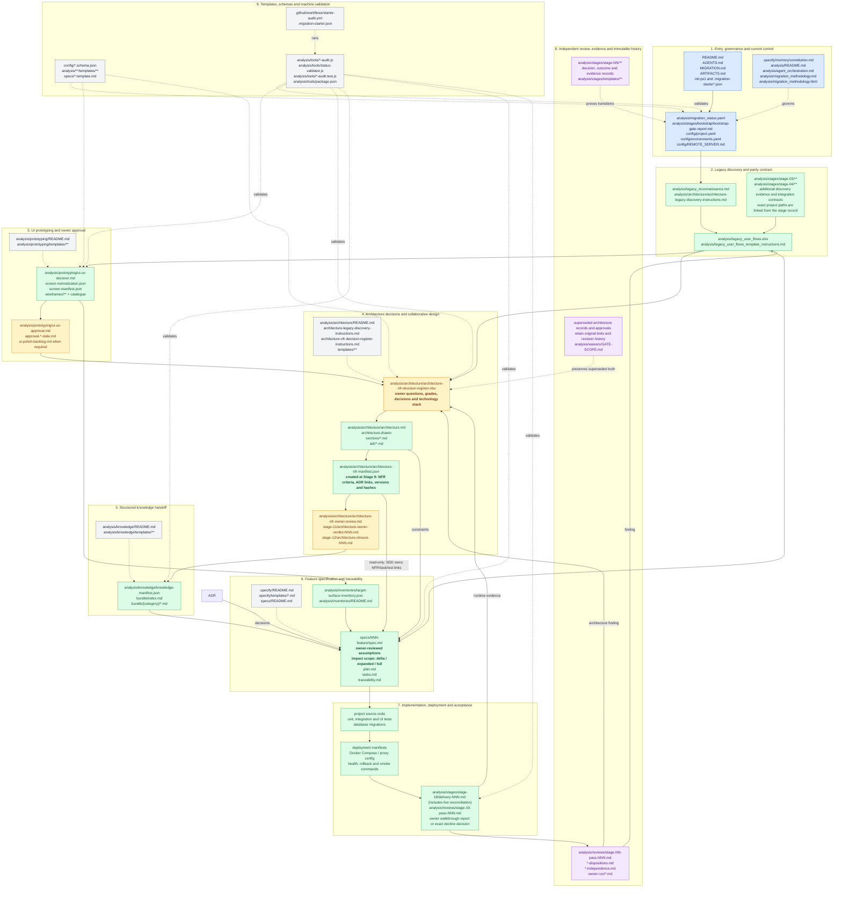

# Artifact Relationship Graph

This map has two levels:

1. **Operational path** - the small set an agent follows during normal work.
2. **Grouped artifact catalogue** - where every governed artifact or artifact
   family belongs. Repeated evidence files are shown as a filename pattern.

`ARTIFACTS.md` remains the authoritative row-by-row catalogue. This document is
the visual navigation layer over that catalogue.

## 1. Operational Path

```mermaid
flowchart LR
    ENTRY["MIGRATION.md<br/>session router: what is allowed now"]
    STATUS["analysis/migration_status.yaml<br/>current stage and next action"]
    METHOD["analysis/migration_methodology.md<br/>how to execute the selected stage"]
    MAP["analysis/legacy_user_flows.xlsx<br/>parity map"]
    ARCH["analysis/architecture/<br/>architecture checkpoint"]
    SDD["specs/NNN-feature/<br/>slice specification"]
    BUILD["application code<br/>tests and deployment"]
    ACCEPT["independent review<br/>owner acceptance"]
    SYNC["architecture sync<br/>record only affected decisions"]

    ENTRY --> STATUS --> METHOD --> MAP --> ARCH --> SDD --> BUILD --> ACCEPT --> SYNC
    SYNC -->|"architecture changed"| ARCH
    SYNC -->|"slice accepted"| STATUS
```

## 2. Complete Grouped Artifact Map

## 3. Group Directory

| Group | Primary files | Purpose | Normal reader |
|---|---|---|---|
| Entry and control | `MIGRATION.md`, `migration_status.yaml`, `bootstrap-gate-report.md`, `ARTIFACTS.md` | Start work, find the current state, and inspect the command-level proof behind Bootstrap readiness | Every agent |
| Governance | constitution, methodology MD/HTML, project/environment config | Non-negotiable rules and operating contract | Orchestrator and reviewers |
| Legacy and parity | reconnaissance, `legacy_user_flows.xlsx`, stage evidence, integration contracts | Prove what the old system does and define the parity boundary | Analyst, architect, SDD author |
| Prototyping | decision, normalization, manifest, `wireframes/**`, independent pass, conditional polish backlog, approval | Define, independently control, and approve the visible target behavior | Designer, owner, UI reviewer |
| Architecture | **`architecture-nfr-decision-register.xlsx`**, Draw.io, architecture MD, ADRs, NFR manifest | Record owner decisions and constrain only the architecture needed for the current slice | Owner, architect, implementer |
| Knowledge | index, concepts, knowledge manifest | Translate approved architecture into structured system knowledge | SDD author and future agents |
| Specification | feature `spec.md` with owner-reviewed assumptions and impact scope, `plan.md`, `tasks.md`, traceability | Make one delivery slice explainable, approved, implementable and testable without rerunning unrelated scope | Owner, implementer and feature reviewer |
| Delivery | code, tests, deployment, delivery/live/acceptance records | Build, deploy and prove the slice | Implementer, operator, acceptance reviewer |
| Review and history | review passes, dispositions, stage records, archive, waivers | Preserve independent findings and superseded truth | Reviewers and auditors; not daily reading |
| Automation | templates, schemas, audit scripts, CI workflow | Prevent malformed or contradictory artifacts | Orchestrator and CI |

## 4. Reading Rules

1. Start with `MIGRATION.md`, then read [`analysis/migration_status.yaml`](./migration_status.yaml).
2. Read only the current slice and the groups it touches.
3. Use `ARTIFACTS.md` when an exact template, schema, tool, or generated-file
   rule is needed.
4. Treat `analysis/reviews/**`, archived architecture, stale approvals, and old
   stage outcomes as evidence, not as the current instruction set.
5. `analysis/architecture/architecture-nfr-decision-register.xlsx` is the owner-facing
   architecture decision register. Its Grade A rows do not form a separate
   up-front phase: open and amend only the decisions required by the current
   slice or contradicted by implementation evidence.

## 5. Starter Source Versus Project Instance

The starter stores instructions, templates, schemas, audits, and example files.
An initialized project creates the corresponding live artifacts, such as
[`analysis/migration_status.yaml`](./migration_status.yaml), [`analysis/legacy_user_flows.xlsx`](./legacy_user_flows.xlsx),
`analysis/prototyping/screen-manifest.json`,
`analysis/architecture/architecture-nfr-decision-register.xlsx`, architecture records,
feature specifications, review reports, and delivery evidence.

## 6. Consolidation Candidates

1. Create one compact modernization roadmap as the owner-facing list of ordered
   slices, dependencies, outcome, and current status.
2. Keep `migration_status.yaml` machine-readable and link it to the same current
   slice instead of duplicating narrative status across reports.
3. Keep the Excel decision register, ADRs, and Draw.io, but open only the rows
   and views affected by the current slice.
4. Keep immutable reports and archives searchable, but outside the normal
   reading path.
5. Consider folding `architecture-nfr-owner-review.md` into a future architecture-checkpoint
   record only after the replacement is designed, validated, and migrated.

<!-- STAGE_ARTIFACT_ROLES_START -->

## Stage Artifact Roles

Shared across stages: error-prevention-checklist.md is read before work and self-checked before handoff; the coordinator updates it only for confirmed generalized lessons. At Stages 2/19 learned checks and prior self-check notes are Phase B only. This standing duty is shown in every stage detail, not repeated as scene arrows. I = read; U = read and update; O = create. Conditional artifacts apply only when required by the stage. A manifest links the full approved source package; its links are not permission to skip those sources. Stages 2 and 19 open restricted records only in Phase B; status conclusions are also withheld. Stage 19 Phase A uses expectation-only extracts of the map, inventory and prototype; full originals follow saved observations. Frames indicate responsibility, not a successful verdict: solid = independent review (including Stage 17 peer review); dashed = responsible-agent verification.

| Stage | I | U | O | Phase B only |
|---|---|---|---|---|
| B: Bootstrap | AGENTS.md; MIGRATION.md; migration_methodology.md | None | constitution.md; migration_status.yaml; project.yaml; environments.yaml; bootstrap-gate-report.md; legacy_reconnaissance.md; legacy_user_flows.xlsx; error-prevention-checklist.md | None |
| 1: Reconnaissance | project.yaml | migration_status.yaml | legacy_reconnaissance.md; legacy_user_flows.xlsx | None |
| 2: Control reconnaissance | None | None | stage-02-pass-NNN.md | legacy_reconnaissance.md (I); legacy_user_flows.xlsx (I); migration_status.yaml (U) |
| 3: Live legacy walkthrough | legacy_user_flows.xlsx; stage-02-pass-NNN.md | migration_status.yaml | stage-03/walkthrough-NNN.md; waivers/GATE-SCOPE.md | None |
| 4: Requirements revision | stage-03/walkthrough-NNN.md | migration_status.yaml; legacy_user_flows.xlsx | stage-04-requirements-revision.md | None |
| 5: Application form and style | legacy_user_flows.xlsx; stage-04-requirements-revision.md | migration_status.yaml | prototyping/ui-ux-decision.md; ui-design-system.md; ui-design-tokens.json; waivers/GATE-SCOPE.md | None |
| 6: Wireframes | legacy_user_flows.xlsx; prototyping/ui-ux-decision.md | migration_status.yaml; ui-design-system.md; ui-design-tokens.json | screen-normalization.json; wireframes/*; screen-manifest.json; waivers/GATE-SCOPE.md | None |
| 7: Wireframe control | legacy_user_flows.xlsx; screen-normalization.json; wireframes/*; screen-manifest.json; ui-design-system.md; ui-design-tokens.json | migration_status.yaml | stage-07-pass-NNN.md; ui-polish-backlog.md | None |
| 8: Wireframe approval | stage-07-pass-NNN.md; screen-manifest.json; wireframes/*; ui-polish-backlog.md; ui-design-system.md; ui-design-tokens.json | migration_status.yaml | prototyping/ui-ux-approval.md | None |
| 9: Architecture requirements | prototyping/ui-ux-approval.md; legacy_user_flows.xlsx; legacy_reconnaissance.md; stage-03/walkthrough-NNN.md; ui-design-system.md; ui-design-tokens.json | migration_status.yaml | architecture-nfr-decision-register.xlsx; architecture-nfr-owner-review.md; architecture.md; architecture/sections/*.md; architecture.drawio; architecture/adr/NNN-*.md; architecture-nfr-manifest.json; waivers/GATE-SCOPE.md; feature-dependencies.json | None |
| 10: Architecture control | architecture-nfr-decision-register.xlsx; architecture-nfr-owner-review.md; architecture.md; architecture/sections/*.md; architecture.drawio; architecture/adr/NNN-*.md; architecture-nfr-manifest.json | migration_status.yaml; feature-dependencies.json | stage-10-pass-NNN.md | None |
| 11: Owner architecture review | stage-10-pass-NNN.md; architecture-nfr-decision-register.xlsx; architecture.md; architecture.drawio; architecture/adr/NNN-*.md; architecture-nfr-manifest.json; feature-dependencies.json | migration_status.yaml | architecture-owner-verdict-NNN.md | None |
| 12: Remark verification | architecture-owner-verdict-NNN.md; architecture.md; architecture/sections/*.md; architecture.drawio; architecture/adr/NNN-*.md; architecture-nfr-manifest.json; feature-dependencies.json | migration_status.yaml | architecture-closure-NNN.md | None |
| 13: Target knowledge synthesis | architecture-owner-verdict-NNN.md; architecture-closure-NNN.md; architecture.md; architecture/sections/*.md; architecture.drawio; architecture/adr/NNN-*.md; architecture-nfr-manifest.json; legacy_user_flows.xlsx; prototyping/ui-ux-approval.md; screen-manifest.json; stage-04-requirements-revision.md; ui-design-system.md; ui-design-tokens.json; feature-dependencies.json | migration_status.yaml | knowledge/bundle/**; knowledge-manifest.json; stage-13/knowledge-record.md; waivers/GATE-SCOPE.md | None |
| 14: Target knowledge control | architecture.md; architecture/sections/*.md; architecture/adr/NNN-*.md; architecture-nfr-manifest.json; knowledge/bundle/**; knowledge-manifest.json; stage-13/knowledge-record.md; ui-design-system.md; ui-design-tokens.json; feature-dependencies.json | migration_status.yaml | stage-14-pass-NNN.md | None |
| 15: Design: SDD | prototyping/ui-ux-approval.md; screen-manifest.json; architecture-nfr-manifest.json; knowledge/bundle/**; knowledge-manifest.json; ui-design-system.md; ui-design-tokens.json | migration_status.yaml; legacy_user_flows.xlsx; ui-polish-backlog.md; feature-dependencies.json | specs/NNN-*/spec.md; specs/NNN-*/plan.md; specs/NNN-*/tasks.md; specs/traceability.md; target-surface-inventory.json; stage-15/sdd-record.md; waivers/GATE-SCOPE.md | None |
| 16: Design re-verification | specs/NNN-*/spec.md; specs/NNN-*/plan.md; specs/NNN-*/tasks.md; specs/traceability.md; target-surface-inventory.json; stage-15/sdd-record.md; ui-polish-backlog.md; ui-design-system.md; ui-design-tokens.json | migration_status.yaml; feature-dependencies.json | stage-16-pass-NNN.md | None |
| 17: Build | stage-16-pass-NNN.md; specs/NNN-*/spec.md; specs/NNN-*/plan.md; specs/NNN-*/tasks.md; ui-design-system.md; ui-design-tokens.json; feature-dependencies.json | migration_status.yaml; specs/traceability.md; target-surface-inventory.json; ui-polish-backlog.md | source code; tests and measurements; data migrations; PR + pinned revision | None |
| 18: Delivery and live reconciliation | PR + pinned revision; environments.yaml; target-surface-inventory.json; prototyping/ui-ux-approval.md; screen-manifest.json; specs/NNN-*/spec.md; ui-polish-backlog.md; ui-design-system.md; ui-design-tokens.json; feature-dependencies.json | migration_status.yaml; specs/traceability.md; legacy_user_flows.xlsx | stage-18/delivery-NNN.md; raw journey + summary | None |
| 19: Slice and final acceptance | None | None | stage-19-pass-NNN.md; owner-walkthrough-NNN.md; owner-walkthrough-decline.md | stage-18/delivery-NNN.md (I); raw journey + summary (I); ui-polish-backlog.md (I); migration_status.yaml (U); legacy_user_flows.xlsx (I); target-surface-inventory.json (I); prototyping/ui-ux-approval.md (I); ui-design-system.md (I); ui-design-tokens.json (I); feature-dependencies.json (I) |
<!-- STAGE_ARTIFACT_ROLES_END -->
